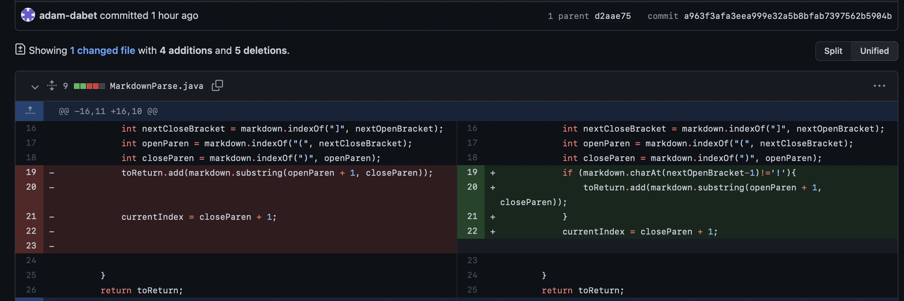
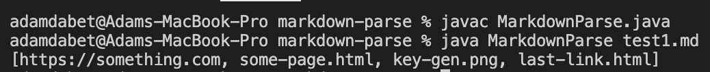
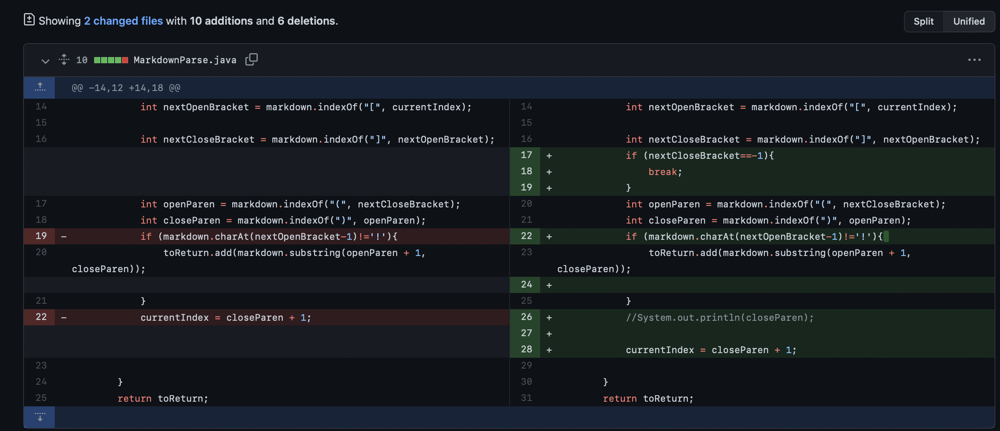
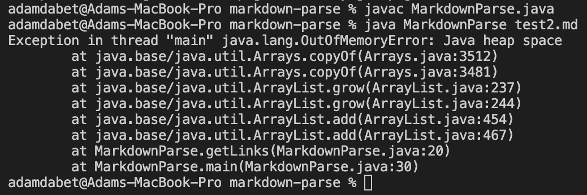
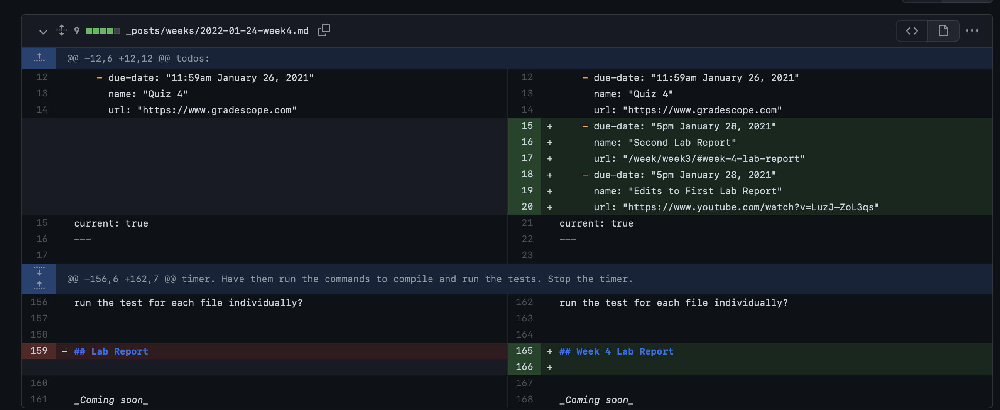
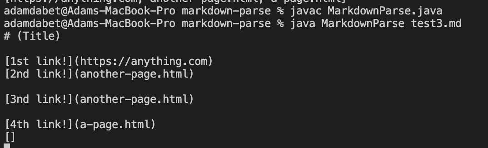

# Week 4 Lab Report 

**First Bug fixed:** Checking that we aren't adding any images to out output.

[This is a link to the file which caused the symptom.](https://github.com/adam-dabet/markdown-parse/blob/main/test1.md)

The symptom is shown here where the image is also being output:

The bug is that we haven't accounted for the difference between images and links in the code, and since they are pretty similar, the images end up being output, which is the symptom. Making sure there isn't a "!" before the parenthesis makes sure we aren't adding an image to our output array. 

**Second Symptom:** Program goes into an infinte loop when it should just print out the links.

[This is a link to the file which caused the symptom.](https://github.com/adam-dabet/markdown-parse/blob/main/test2.md)

The symptom was that there was an infinte loop that was caused by a single "[" in the file. 

This symptom is caused because when there are no ] and() the index fails to be updated correctly so the index never becomes greater than markdown.length so the loop carrys on forever. So to fix it I added an if statement after the closeparen that if it is equal to -1(which means there was no "]"), the loop stops.

**Third Symptom:** Program prints out empty [] thinking that is a link in the file, and continues to an infinite loop.

[This is a link to the file which caused the symptom.](https://github.com/adam-dabet/markdown-parse/blob/main/test3.md)

The image shows how the output is incorrect as the program isn't doing what it's intended to do and causes an error with the inifinite loop.

The symptom was the same as the one caused by the second bug, which was an infinite loop, which is again caused by the index being updated incorrectly. Having [] in the file causes the openParen value to become -1, which causes the closeParen value to be wrong and never be less than the markdown.length, causing an infinte loop. 