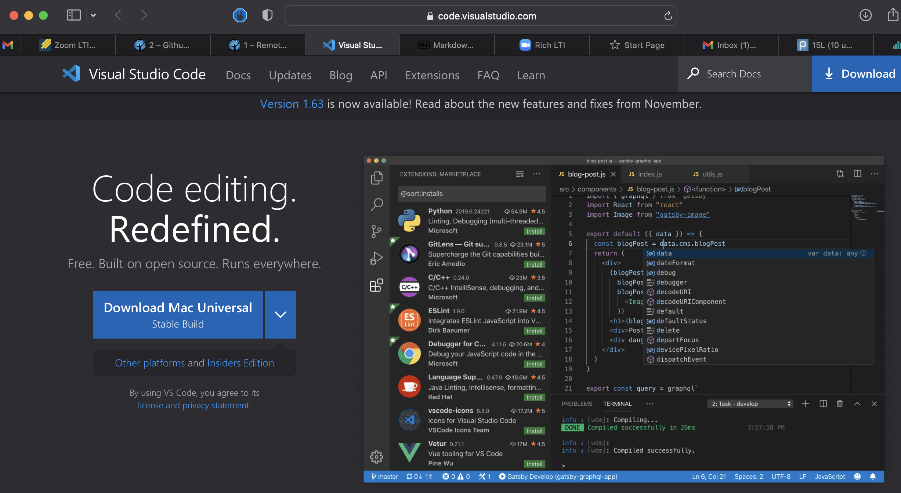
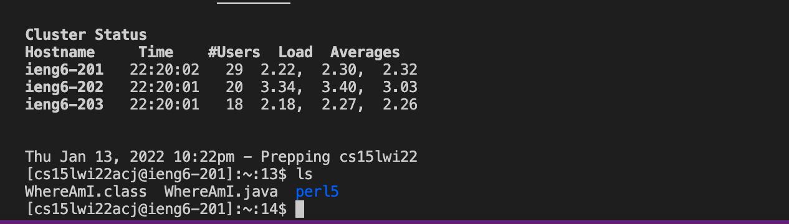
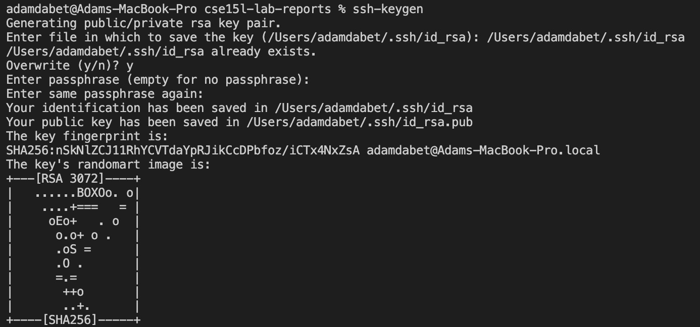
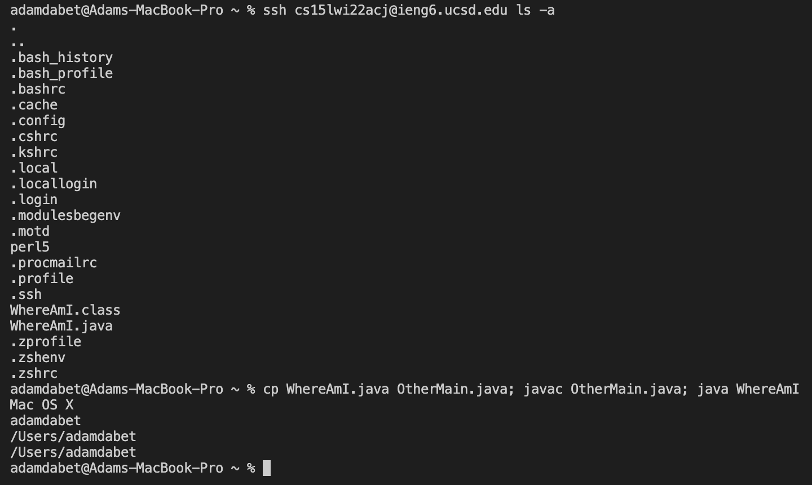

# Week 2 Lab Report 
[Lab Report Week 2](https://adam-dabet.github.io/cse15l-lab-reports/lab-report-1-week-2.html)

**Step 1**: Installing VScode

Click on this link [https://code.visualstudio.com](https://code.visualstudio.com) and follow the instructions on their website. Make sure to install the right version for your device, since I have a Mac I will install the MacOS version.



---

**Step 2**: Remotely connecting

If you are on windows you will first have to click on [SSH](https://docs.microsoft.com/en-us/windows-server/administration/openssh/openssh_install_firstuse) and install it for this to work.

If you are on mac like me, then you should click on this [link](https://sdacs.ucsd.edu/~icc/index.php) to look for your course specific account. Your account name should be cs15lwi22"""@ieng6.ucsd.edu with a unique 3 letters to replace the """.
Once you have found the account you will have to reset the password and wait for about 10-15 mins before the next step for it to work.

Open up a VScode terminal and type in this command:
```
ssh cs15lwi22"""@ieng6.ucsd.edu
```
It will ask you to type in your password, but after that you are logged into the ieng6. This is what it should look like.

 {
        System.out.println(System.getProperty("os.name"));
        System.out.println(System.getProperty("user.name"));
        System.out.println(System.getProperty("user.home"));
        System.out.println(System.getProperty("user.dir"));
  }

}

Run this code with javac and then java.

Then open the terminal and type this command in:
```
scp WhereAmI.java cs15lwi22"""@ieng6.ucsd.edu:~/
```



Then log into ssh and type the command ls, and you should find the file WhereAmI.java in the directory, and you can even run it from the ieng6 computer. Note the difference in output when you run it on your device vs on the ieng6 computer.

---	

**Step 5**: Setting an SSH Key

So far you've had to write your password everytime you log into the ieng6 computer. This step will make it so you are no longer asked for the password.
Type in this command on your computer.
```
ssh-keygen
```
It will ask for a passphrase, which you should just press enter to have no passphrase, then it will ask for a file to save the key in, which your will enter the same one thats in the brackets.



Next, ssh to ieng6, and type the commands:
```
 mkdir .ssh
<logout>
```
The logout command will get you back on the client, where you will then type in this command, but use the path from the previous command. Then type this command:
```
scp /Users/adamdabet/.ssh/id_rsa.pub cs15lwi
"""@ieng6.ucsd.edu:~/ssh/authorized_keys
```
After this, you can ssh or scp without a password.

---	

**Step 6**: Optimizing Remote Running
Some ways to make these processes easier are:

* Using the up arrow key to recall previous commands you used.
* Wrtie commands at the end of an ssh command to run it directly on the server.
* You can use semi-colons to run multiple commands in the same line.


