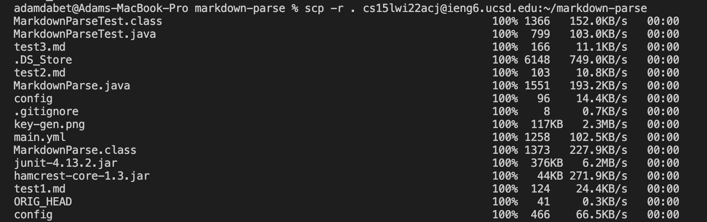
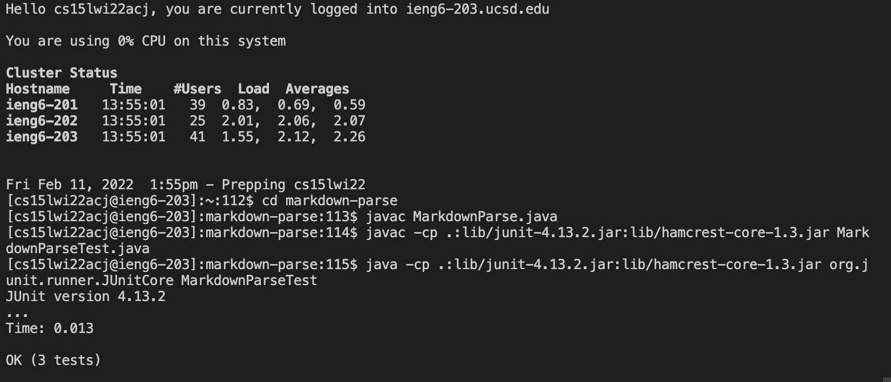
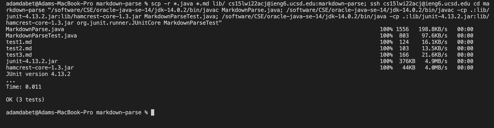

# Week 6 Lab Report 

**Copy Whole Directories with ```scp -r```**


First you have to write the command to copy the markdown-parse directory.
```
scp -r . cs15lwi22'''@ieng6.ucsd.edu:~/markdown-parse
```
The -r means it will copy recursively. The ~/markdown-parse tells scp to create the markdown-parse directory on the ieng6, and then copy the contents of the directory recursively there.




Now you can log into your ieng6 account with ```ssh``` and run the tests for a repository using javac and java.




You can combine all the commands into one line and directly compile and run the tests.
The commands I used were:
```
scp -r *.java *.md lib/ cs15lwi22acj@ieng6.ucsd.edu:markdown-parse; ssh cs15lwi22acj@ieng6.ucsd.edu cd markdown-parse "/software/CSE/oracle-java-se-14/jdk-14.0.2/bin/javac MarkdownParse.java; /software/CSE/oracle-java-se-14/jdk-14.0.2/bin/javac -cp .:lib/junit-4.13.2.jar:lib/hamcrest-core-1.3.jar MarkdownParseTest.java; /software/CSE/oracle-java-se-14/jdk-14.0.2/bin/java -cp .:lib/junit-4.13.2.jar:lib/hamcrest-core-1.3.jar org.junit.runner.JUnitCore MarkdownParseTest"
```

The star before .java and .md are to tell scp to only copy those types of files because when I didn't do that the class files were causing errors because my java is a different version than the ieng6. 

Then you log into ieng6 with ssh, change direcotry, and run the commands for javac and java. Because of the error I was getting with the java versions I had to change javac to ```/software/CSE/oracle-java-se-14/jdk-14.0.2/bin/javac```
and java to ``` /software/CSE/oracle-java-se-14/jdk-14.0.2/bin/java```


