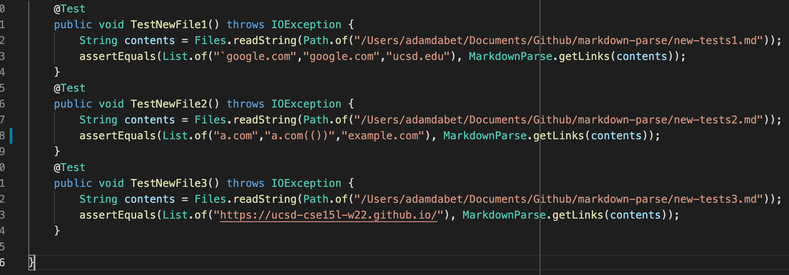
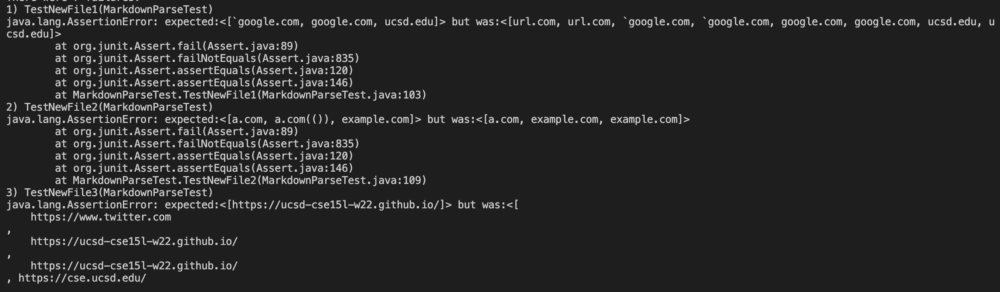
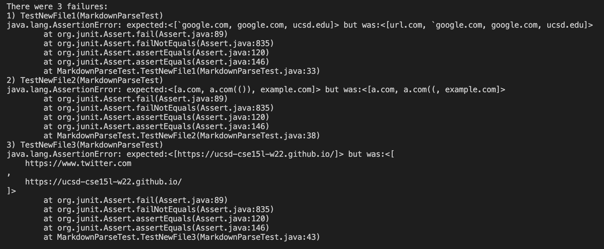

# Week 8 Lab Report 

[Link to my markdown-parse repository](https://github.com/adam-dabet/markdown-parse)

[Link to the repository I reviewed](https://github.com/ericwpei/markdown-parse)

This is how I tested the new files:

These are the results of the tests for the implementation I reviewed, where all 3 of them failed.

These are the results of the tests for my implementation, where all 3 of them failed.

To fix snippet 1, there was only 1 issue that 'url.com' was being printed when it shouldn't be. It should be a simple fix which is to check if the index before the bracket or parenthesis has a ` before it, and if it does then don't add the link to the list.

Snippet 2 is causing 1 issue:
 
It only prints out "a.com((" without "a.com(()" because it thinks the parentheis is the end of the link. 

This should also be a simple fix which is to check if there are any other close parenthesis right after the first one, and if there is, add 1 to the value of closeParen. Or if there are any other close brackets 

The third snippet has 1 problem which is that it prints out a link which has title text that has new lines. I think this one is a little harder to solve. This is because you would have to split the part in the brackets and the link in the parenthesis. If there is are 2 newlines in the brackets, then it shoudln't count as a link, and if there are 2 newlines inside the parenthesis, then it shouldn't count as a link, or if there is .
You would also need to make sure that if there is a newline after the open parenthesis that it still counts a as a link.
This is more complicated than the other snippets and would take more than 10 lines to fix. 

