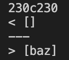
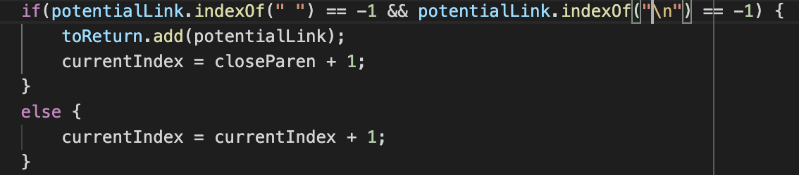

# Week 10 Lab Report 


I found the tests with different results using this command:
```
diff markdown-parse/lab-9-My-markdown/results.txt markdown-parse/lab-9-markdown-parse/markdown-parse/results.txt
```

The command prints out all the differences between results.txt of my markdown-parse and the professors markdown-parse. 

1st Difference found in:
   
    test-files/201.md




This is the output in my markdown-parse file vs the professors.

The files contents were:
```
[foo]: <bar>(baz)
[foo]
```
I believe this should return an empty list because there are some characters between the close bracket and the open parenthesis, which makes it not a link. This means my implementation is correct for this test file, but the professors is not.


The bug is that the code doesn't check if there are characters in between the close bracket and the open parenthesis, so an extra condition should be added in the if statement before adding the link.

2nd Difference found in:


